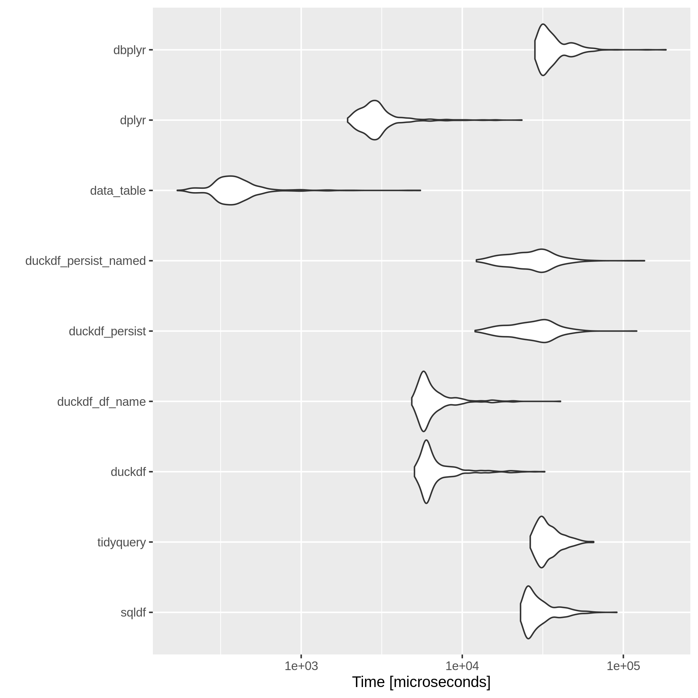
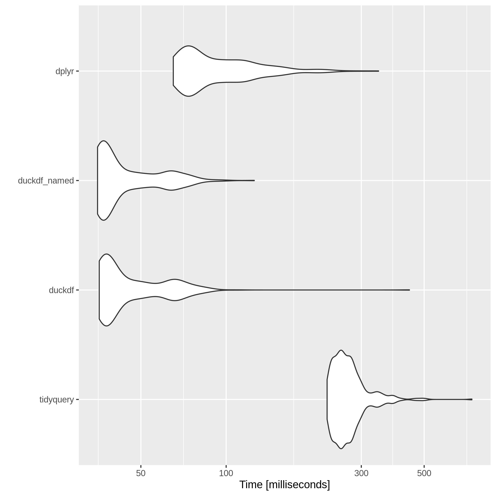

🦆 Ducks all the way down
=======

This is a convenience package for everyone who has a deep and abiding love affair with SQL (and ducks).

Instead of using other incredibly popular and useful packages like [data.table](https://rdatatable.gitlab.io/data.table/) or [dplyr](https://dplyr.tidyverse.org/), one could use `duckdf` instead to slice and dice dataframes with SQL. Precedence exists in the [sqldf](https://github.com/ggrothendieck/sqldf) package, but this one is better because it quacks (although is not nearly as comprehensive, well planned or tested).

It's also meant to be a bit of fun.

## Quick Start

To install this package, first install [duckdb](https://duckdb.org/):

```r
install.packages("duckdb")
```
This package has been tested against the 0.2.4 version of `duckdb`

Then install `duckdf` with the `remotes` package.

```r
# install.packages("remotes")
library("remotes")
remotes::install_github("phillc73/duckdf")
library("duckdf")
```

## Usage

If you want to write "normal" SQL SELECT statements in an R function, against an existing dataframe:

```r
duckdf("SELECT mpg, cyl FROM mtcars WHERE disp >= 200")
```

This registers the well known `mtcars` dataset as a virtual table in the `duckdb` database, then selects just the columns `mpg` and `cyl`, where the `disp` column is greater than 200.

In reality, this function is just a simple wrapper around a collection of `DBI` functions, such as `dbConnect()`, `dbGetQuery()`, `dbDisconnect()` and the `duckdb` function `duckdb_register`.

Joins of up to two dataframes are supported. See the `nycflights13` benchmark example below for such an SQL query.

```r
duckdf_persist("SELECT mpg, cyl FROM mtcars WHERE disp >= 200")
```
The above is obviously the same SQL statement, however by using `duckdf_persist()` an on-disk `duckdb` database is created in the current working directory. The name of the database will be the same as the dataframe name.

However, it is also possible to define a specific on-disk database name.

```r
duckdf_persist("SELECT mpg, cyl FROM mtcars WHERE disp >= 200",
                db_name = "mt_cars")
```

The main `duckdf()` function can also be used to write a database to disk.

```r
duckdf("SELECT mpg, cyl FROM mtcars WHERE disp >= 200",
       persist = TRUE)
```
It is not currently possible to define the database name using only `duckdf()`. The on-disk database defaults to the name of the first dataframe included in the query.

If you've already created a DuckDB database, or received one from the flock, it is possible to return some brief information about each table it contains. Assuming the database on disk is named `mtcars`

```r
duckdb_gander("mtcars")
```

Assuming the database is in the current working directory, this returns a list of the first five rows from each table. Each list item name corresponds with the database table name. Databases with up to two tables are supported.

```r
duckdb_gander("mtcars", show_types = TRUE)
```
This returns a named list as well, but the table column types are now shown.

This following function simply removes all traces of the `duckdb` called `mtcars` from the current working directory.

```r
duckdf_cleanup("mtcars")
```

This package now also supports DuckDB's CSV reader. In the spirit of R packages using obscure verbs to describe functions, in this package we have `duckdf_ingest()`

```r
duckdf_ingest(name = "descriptive_name", 
              file = "filename.csv", 
              persist = TRUE)
```
The above will ingest the file called `filename.csv`, if found in the current working directory, into a `duckdb` database named, `descriptive_name`, and save it to disk. The single table in the database will also be called `descriptive_name`. This data can then be queried with `duckdf_persist()`. 

If `persist = FALSE`, only a dataframe in the global environment is created, via a `duckdb` virtual table intermediate, and then `duckdf()` may be used to query it directly.

It is also possible to define the returned object as either a `data.table` or `tibble`. The default returned object is a `data.frame`.

```r
duckdf_ingest(name = "descriptive_name", 
              file = "filename.csv", 
              persist = FALSE,
              object_type = "data.table")
```

## Benchmarks

Is this package any good? If some measure of good is the speed at which results are returned, then this package is reasonably good.

The benchmarks below are generated on a laptiop with an i7-8565U CPU. If you try these numbers yourself, the results will differ but the general themes should remain the same.

The current `duckdf` SELECT functions have been vaguely tested against other popular approaches including `data.table`, `dplyr`, `dbplyr`, `tidyquery` and `sqldf`.

Coinsidering only simple queries, `duckdf()` is significantly faster than `sqldf` and `tidyquery`, somewhat faster than the current implementation of `dbplyr`, not quite as fast as `dplyr` and much, much slower than `data.table`. In fact, if you'd like to query a `data.table` more slowly, `duckdf` can support that too.

`duckdf_persist()` is slow because it writes or reads a `duckdf` database to disk on each iteration.

```r
# duckdb v0.2.4
library(duckdb)
library(duckdf)
# dplyr 1.0.3
library(dplyr)
# dbplyr 2.0.0
library(dbplyr)
library(microbenchmark)
# sqldf 0.4-11
library(sqldf)
# data.table 1.13.7
library(data.table)
# tidyquery 0.2.1
library(tidyquery)
library(ggplot2)

# Make a data.table
mtcars_data_table <- data.table(mtcars)

# dbplyr test function
dbplyr_test <- function() {
    con <- dbConnect(duckdb::duckdb(), ":memory:")

    copy_to(con, mtcars, "mtcars_dbplyr", temporary = FALSE)

    mtcars_db <- tbl(con, "mtcars_dbplyr")

    DBI::dbDisconnect(con, shutdown = TRUE)

    mtcars_result <- mtcars_db %>%
    dplyr::filter(disp >= 200) %>%
    dplyr::select(mpg,cyl)

    return(mtcars_result)

}

# Run the benchmark as often as you like
duck_bench <- microbenchmark(times=500,
                             # sqldf library
                             sqldf = {sqldf("SELECT mpg, cyl FROM mtcars WHERE disp >= 200")},
                             # tidyquery library
                             tidyquery =  {query("SELECT mpg, cyl FROM mtcars WHERE disp >= 200")},
                             # duckdf library
                             duckdf = {duckdf("SELECT mpg, cyl FROM mtcars WHERE disp >= 200")},
                             duckdf_persist = {duckdf_persist("SELECT mpg, cyl FROM mtcars WHERE disp >= 200")},
                             # data.table library
                             data_table = {mtcars_data_table[disp >= 200, c("mpg", "cyl"),]},
                             # dplyr library
                             dplyr = {mtcars %>%
                               dplyr::filter(disp >= 200) %>%
                               dplyr::select(mpg,cyl)},
                             # dbplyr library
                             dbplyr = {dbplyr_test()}
                            )

autoplot(duck_bench)
```



But wait, there's more. A more complex query benchmark, this time compared to `tidyquery` using the SQL example from their [README page](https://github.com/ianmcook/tidyquery), and the `dplyr` equivalent generated through the `tidyquery` `show_dplyr()` function. The result is different and the `duckdb` and `duckdf` combination appear to be quickest.

```r
# duckdb 0.2.4
library(duckdb)
library(duckdf)
# dplyr 1.0.3
library(dplyr)
# tidyquery 0.2.1
library(tidyquery)
library(microbenchmark)
library(ggplot2)
library(nycflights13)

vs_tidyquery <- microbenchmark(times = 500,

                                          tidyquery = {
                                            tidyquery::query(
                                          "SELECT origin, dest,
                                              COUNT(flight) AS num_flts,
                                              round(SUM(seats)) AS num_seats,
                                              round(AVG(arr_delay)) AS avg_delay
                                            FROM flights f LEFT OUTER JOIN planes p
                                              ON f.tailnum = p.tailnum
                                            WHERE distance BETWEEN 200 AND 300
                                              AND air_time IS NOT NULL
                                            GROUP BY origin, dest
                                            HAVING num_flts > 3000
                                            ORDER BY num_seats DESC, avg_delay ASC
                                            LIMIT 2;"
                                                            )
                                                      },

                                          duckdf = {
                                            duckdf(
                                          "SELECT origin, dest,
                                              COUNT(flight) AS num_flts,
                                              round(SUM(seats)) AS num_seats,
                                              round(AVG(arr_delay)) AS avg_delay
                                            FROM flights f LEFT OUTER JOIN planes p
                                              ON f.tailnum = p.tailnum
                                            WHERE distance BETWEEN 200 AND 300
                                              AND air_time IS NOT NULL
                                            GROUP BY origin, dest
                                            HAVING COUNT(flight) > 3000
                                            ORDER BY num_seats DESC, avg_delay ASC
                                            LIMIT 2;"
                                                  )
                                                    },

                                          dplyr = {
                                            flights %>%
                                              left_join(planes, by = "tailnum", suffix = c(".f", ".p"), na_matches = "never") %>%
                                              rename(f.year = "year.f", p.year = "year.p") %>%
                                              filter(dplyr::between(distance, 200, 300) & !is.na(air_time)) %>%
                                              group_by(origin, dest) %>%
                                              filter(sum(!is.na(flight)) > 3000) %>%
                                              summarise(num_flts = sum(!is.na(flight)), 
                                                        num_seats = round(sum(seats, na.rm = TRUE)), 
                                                        avg_delay = round(mean(arr_delay, 
                                                        na.rm = TRUE))) %>%
                                              ungroup() %>%
                                              arrange(dplyr::desc(num_seats), avg_delay) %>%
                                              head(2)
                                                  }
                                )

autoplot(vs_tidyquery)
```


Of course there are lies, damn lies and benchmarks. Different datasets, of different size or different column types, using different queries, may produce entirely different results.

